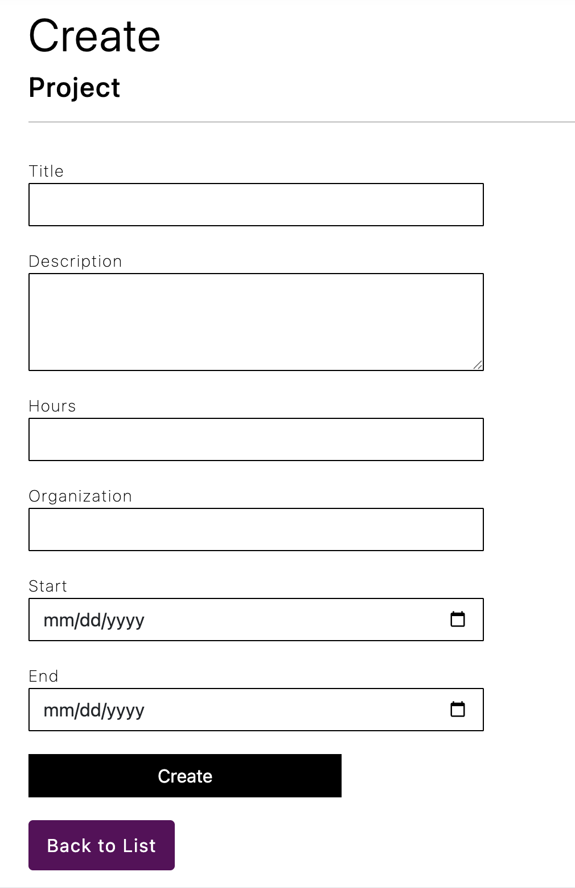
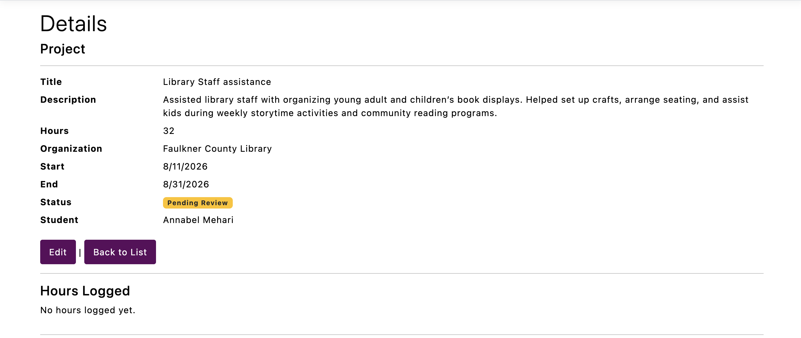
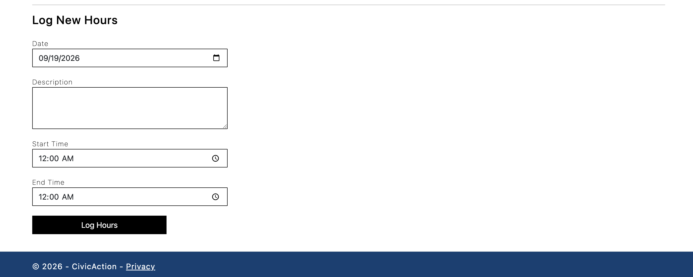
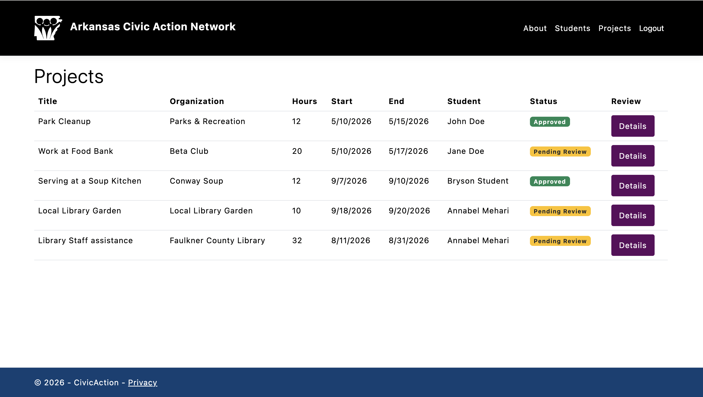

# CIVIC ACTION
## Dylan Carter, Bryson DeLozier, Rayden King, Anthony Sandoval

## SUMMARY
Civic Action helps students document their community service and project work in one place. Students can record volunteer experiences, organize their service by organization, and submit updates for review. Admin users can verify project submissions and approve or reject entries.

## Features
- Create and manage student accounts
- Create, edit, view, and delete volunteer projects
- Record project titles and descriptions
- Track volunteer hours
- Add organization names
- Record project start and end dates
- Add updates to existing projects
- Allow administrators to approve or reject submitted projects
- Provide feedback on verification requests

## Project Information
Each volunteer project can include:

- Title
- Description
- Number of hours
- Organization name
- Start date
- End date
- Project updates
- Verification status

Students can continue editing their projects and adding more hours or updates after signing in.

## How to run it locally**
### Prerequisites

Before running the website, install:

- Visual Studio Code
- C# Dev Kit for Visual Studio Code
- .NET 10.0 SDK

To run the program, open a new terminal and type 'dotnet run'.

## Screenshots

### Create a Project

### Project Details

### Additional Project Details

### Projects

### Application View
